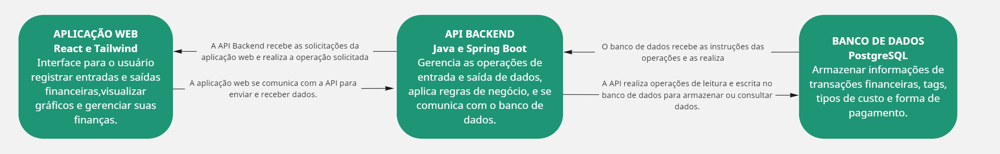

# Documentação da Arquitetura de Software

## Visão Geral
Este documento descreve a arquitetura de software do sistema Budget Buddy utilizando o C4 Model. A arquitetura é apresentada em quatro níveis: Contexto, Container, Componente e Código.

---
_**Instruções de Uso:**_

- _**Contexto**: Adicione uma visão geral de como o sistema interage com os usuários e sistemas externos._
- _**Containers**: Detalhe as principais partes do sistema, como a aplicação web, banco de dados, etc._
- _**Componentes**: Descreva a estrutura interna dos containers, detalhando os módulos e serviços principais._
- _**Código (Opcional)**: Use este nível para detalhar classes ou módulos críticos se necessário._
- _**Decisões Arquiteturais**: Documente as decisões tomadas e suas justificativas._
---

## 1. Diagrama de Contexto

### 1.1. Descrição do Diagrama de Contexto
O diagrama de contexto fornece uma visão geral de alto nível do sistema e suas interações com os atores externos.

- **Sistema:** Budget Buddy
- **Atores Externos:** Usuários, Equipe de Desenvolvimento

### 1.2. Diagrama

### 1.3. Descrição dos Componentes
- **Atores Externos:** Usuário: O usuário interage com o sistema através do cadastro de entradas e saídas. O sistema interage com o usuário armazenando as entradas e saídas e gerando gráficos para detalhamento dos custos.
- **Sistema:** O sistema tem como objetivo auxiliar no gerenciamento de finanças pessoais, sendo possível inserir entradas e saídas monetárias para registrar os gastos mensais, além de fornencer uma visão mais detalhada e agrupada sobre as entradas e saídas.

---

## 2. Diagrama de Container

### 2.1. Descrição do Diagrama de Container
O diagrama de container mostra os principais containers de software que compõem o sistema e como eles interagem entre si.

- **Containers Incluídos:** Aplicação WEB, Banco de dados e API

### 2.2. Diagrama

### 2.3. Descrição dos Containers
- **Aplicação Web:** 
  - **Tecnologias:** React e Tailwind
  - **Responsabilidade:** Interface para o usuário registrar entradas e saídas financeiras,visualizar gráficos e gerenciar suas finanças.
  - **Interações:** Aplicação Web <-> API Backend
- **API Backend:** 
  - **Tecnologias:** Java, Spring Boot e Docker
  - **Responsabilidade:** Gerencia as operações de entrada e saída de dados, aplica regras de negócio, e se comunica com o banco de dados.
  - **Interações:** Aplicação Web <-> API Backend <-> Banco de Dados
- **Banco de Dados:** 
  - **Tecnologias:** PostgreSQL e Docker
  - **Responsabilidade:** Armazenar informações de transações financeiras, tags, tipos de custo e forma de pagamento.
  - **Interações:** API Backend <-> Banco de Dados

---

## 3. Diagrama de Componente

### 3.1. Descrição do Diagrama de Componente
O diagrama de componente detalha a arquitetura interna de cada container, mostrando os componentes que o compõem e suas interações.

### 3.2. Descrição dos Componentes

### 3.2.1 Diagramas - Aplicação WEB
- **React:** 
  - **Responsabilidade:** Biblioteca do JS responsável otimizar o frontend através da componentização de features.
  - **Interações:** O React interage com o Tailwind CSS de maneira bastante eficiente, pois o Tailwind é uma biblioteca de utilitários CSS que pode ser usada diretamente nos componentes React sem precisar de arquivos CSS adicionais. Isso se dá principalmente pela forma modular e baseada em classes do Tailwind, que permite estilizar componentes com classes utilitárias diretamente no JSX de cada componente React.
  - **Tecnologias:** React

- **Tailwind:** 
  - **Responsabilidade:** Framework baseado em utilidades e tem como prioridade a facilidade de customização e estilização do fronted.
  - **Interações:** O Tailwind CSS interage com React facilitando o uso de estilos utilitários diretamente nos componentes. Em vez de criar arquivos CSS separados, você aplica classes utilitárias do Tailwind diretamente nos elementos JSX. Isso torna o processo de estilização mais rápido e modular, pois os estilos são definidos inline com as classes do Tailwind.
  - **Tecnologias:** Tailwind

### 3.2.2 Diagrama - API Backend

### Descrição dos Componentes
- **Java + Spring Boot:** 
  - **Responsabilidade:** O Java usa o Spring Boot para simplificar o desenvolvimento de aplicações Java, especialmente no backend.
  - **Interações:** O Spring Boot é um framework que configura automaticamente o ambiente e as dependências, permitindo que você crie aplicações com menos esforço.
  - **Tecnologias:** Java + Spring Boot

- **Docker:** 
  - **Responsabilidade:** O Docker é uma plataforma de virtualização leve que permite empacotar aplicações e suas dependências em contêineres. Cada contêiner é isolado, garantindo que a aplicação rode da mesma forma em qualquer ambiente, seja no desenvolvimento ou produção. Assim, não sendo necessário que toda a equipe precise instalar as mesmas dependências do projeto.
  - **Interações:** Com Docker, é fácil escalar e gerenciar múltiplas instâncias de aplicações Spring Boot, utilizando ferramentas como Docker Compose para orquestrar os contêineres para criar a imagem Docker, como basear a imagem em um JDK, copiar o arquivo .jar da aplicação e configurar o comando para executar o Spring Boot.
  - **Tecnologias:** Docker

### 3.2.3 Diagrama - Banco de Dados

### Descrição dos Componentes
- **PostgreSQL:** 
  - **Responsabilidade:** A responsabilidade do PostgreSQL é gerenciar, armazenar e recuperar dados de forma segura e eficiente. Ele é um banco de dados relacional que garante integridade, confiabilidade e suporte a consultas SQL complexas. O PostgreSQL também oferece suporte a transações, concorrência, e extensões como JSON e geolocalização.
  - **Interações:** O PostgreSQL interage com o Docker através de um contêiner. O Docker cria um ambiente isolado que roda o PostgreSQL, permitindo fácil instalação e configuração. Você pode executar o PostgreSQL em um contêiner usando uma imagem oficial, e definir volumes para persistir os dados. Com isso, o banco de dados roda de forma independente e replicável em qualquer sistema.
  - **Tecnologias:** PostgreSQL

- **Docker:** 
  - **Responsabilidade:** O Docker é uma plataforma de virtualização leve que permite empacotar aplicações e suas dependências em contêineres. Cada contêiner é isolado, garantindo que a aplicação rode da mesma forma em qualquer ambiente, seja no desenvolvimento ou produção. Assim, não sendo necessário que toda a equipe precise instalar as mesmas dependências do projeto.
  - **Interações:** O Docker interage com o PostgreSQL criando contêineres que isolam e executam o banco de dados de forma independente. Com um contêiner Docker, você pode rodar uma instância do PostgreSQL em qualquer ambiente, sem precisar configurá-lo manualmente. Basta usar um Dockerfile ou docker-compose.yml para especificar a imagem do PostgreSQL, volumes para persistir os dados e portas para acesso externo. Isso facilita a replicação e o gerenciamento do banco em ambientes de desenvolvimento e produção.
  - **Tecnologias:** Docker

---

## 4. Diagrama de Código (Opcional)

### 4.1. Descrição do Diagrama de Código
Este nível detalha o design e a arquitetura do código dentro de um componente específico. Ideal para sistemas complexos ou quando há necessidade de documentar padrões de design específicos.

### 4.2. Diagrama

### 4.3. Descrição do Código
- **[Nome da Classe/Módulo]:** Descrição da estrutura de código, padrões de design utilizados e principais responsabilidades.
  - **Métodos:** [Descrição dos principais métodos e sua funcionalidade]
  - **Padrões de Design:** [Padrões de design aplicados, como Singleton, Factory, etc.]

---

## 5. Decisões Arquiteturais

### 5.1. Decisões Importantes
Documente aqui as decisões arquiteturais importantes que foram tomadas durante o desenvolvimento do projeto, incluindo justificativas e impactos.

- **Decisão:** Banco de Dados Relacional
  - **Descrição:** Optou-se por utilizar um banco de dados relacional (PostgreSQL) para armazenar os dados dos usuários, como entradas de receitas, despesas e histórico de transações.
  - **Justificativa:** A escolha foi feita considerando a necessidade de transações seguras, integridade referencial e suporte a operações complexas de consulta, essenciais para a consistência dos dados financeiros além da equipe ter uma maior familiaridade com o PostgreSQL em conjunto com a peculiaridade de usarmos todas as funcionalidades sem a necessidade de comprar licenças de mercado.
  - **Impacto:**  O uso de um banco de dados relacional garante maior consistência e integridade dos dados, mas pode limitar a escalabilidade em comparação com um banco NoSQL, que seria mais flexível para grandes volumes de dados.

---

## 6. Considerações Finais

### 6.1. Padrões e Práticas
Liste os padrões arquiteturais e práticas recomendadas que foram seguidos durante o desenvolvimento da arquitetura.

- **Padrões:** [Ex: MVC, CQRS, Event-Driven Architecture]
- **Práticas:** [Ex: Continuous Integration, Code Review, etc.]

### 6.2. Próximos Passos
Indique quaisquer melhorias futuras ou áreas a serem exploradas para a evolução da arquitetura.

---

**Autores:** [Nome dos Integrantes da Equipe]  
**Data:** [Data de Criação do Documento]
