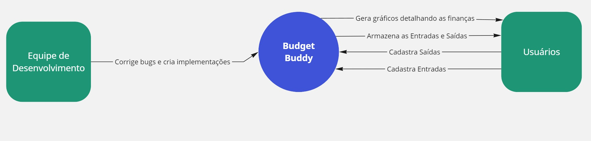

# Documentação da Arquitetura de Software

## Visão Geral
Este documento descreve a arquitetura de software do sistema Budget Buddy utilizando o C4 Model. A arquitetura é apresentada em quatro níveis: Contexto, Container, Componente e Código.

---
_**Instruções de Uso:**_

- _**Contexto**: Adicione uma visão geral de como o sistema interage com os usuários e sistemas externos._
- _**Containers**: Detalhe as principais partes do sistema, como a aplicação web, banco de dados, etc._
- _**Componentes**: Descreva a estrutura interna dos containers, detalhando os módulos e serviços principais._
- _**Código (Opcional)**: Use este nível para detalhar classes ou módulos críticos se necessário._
- _**Decisões Arquiteturais**: Documente as decisões tomadas e suas justificativas._
---

## 1. Diagrama de Contexto

### 1.1. Descrição do Diagrama de Contexto
O diagrama de contexto fornece uma visão geral de alto nível do sistema e suas interações com os atores externos.

- **Sistema:** Budget Buddy
- **Atores Externos:** Usuários, Equipe de Desenvolvimento

### 1.2. Diagrama

### 1.3. Descrição dos Componentes
- **Atores Externos:** Usuário: O usuário interage com o sistema através do cadastro de entradas e saídas. O sistema interage com o usuário armazenando as entradas e saídas e gerando gráficos para detalhamento dos custos.
- **Sistema:** O sistema tem como objetivo auxiliar no gerenciamento de finanças pessoais, sendo possível inserir entradas e saídas monetárias para registrar os gastos mensais, além de fornencer uma visão mais detalhada e agrupada sobre as entradas e saídas.

---

## 2. Diagrama de Container

### 2.1. Descrição do Diagrama de Container
O diagrama de container mostra os principais containers de software que compõem o sistema e como eles interagem entre si.

- **Containers Incluídos:** [Ex: Aplicação Web, Banco de Dados, API, etc.]

### 2.2. Diagrama

### 2.3. Descrição dos Containers
- **[Nome do Container]:** Descrição do container, sua responsabilidade e tecnologias utilizadas.
  - **Tecnologias:** [Ex: Spring Boot, MySQL, etc.]
  - **Responsabilidade:** [Função principal do container]
  - **Interações:** [Containers com os quais interage]

---

## 3. Diagrama de Componente

### 3.1. Descrição do Diagrama de Componente
O diagrama de componente detalha a arquitetura interna de cada container, mostrando os componentes que o compõem e suas interações.

- **Container Focado:** [Nome do Container]

### 3.2. Diagrama

### 3.3. Descrição dos Componentes
- **[Nome do Componente]:** Descrição do componente, sua responsabilidade e interações.
  - **Responsabilidade:** [Função principal do componente]
  - **Interações:** [Componentes com os quais interage]
  - **Tecnologias:** [Linguagens, frameworks, bibliotecas]

---

## 4. Diagrama de Código (Opcional)

### 4.1. Descrição do Diagrama de Código
Este nível detalha o design e a arquitetura do código dentro de um componente específico. Ideal para sistemas complexos ou quando há necessidade de documentar padrões de design específicos.

### 4.2. Diagrama

### 4.3. Descrição do Código
- **[Nome da Classe/Módulo]:** Descrição da estrutura de código, padrões de design utilizados e principais responsabilidades.
  - **Métodos:** [Descrição dos principais métodos e sua funcionalidade]
  - **Padrões de Design:** [Padrões de design aplicados, como Singleton, Factory, etc.]

---

## 5. Decisões Arquiteturais

### 5.1. Decisões Importantes
Documente aqui as decisões arquiteturais importantes que foram tomadas durante o desenvolvimento do projeto, incluindo justificativas e impactos.

- **Decisão:** [Nome ou breve descrição da decisão]
  - **Descrição:** [Detalhes sobre a decisão]
  - **Justificativa:** [Motivo pelo qual a decisão foi tomada]
  - **Impacto:** [Impacto da decisão no sistema]

---

## 6. Considerações Finais

### 6.1. Padrões e Práticas
Liste os padrões arquiteturais e práticas recomendadas que foram seguidos durante o desenvolvimento da arquitetura.

- **Padrões:** [Ex: MVC, CQRS, Event-Driven Architecture]
- **Práticas:** [Ex: Continuous Integration, Code Review, etc.]

### 6.2. Próximos Passos
Indique quaisquer melhorias futuras ou áreas a serem exploradas para a evolução da arquitetura.

---

**Autores:** [Nome dos Integrantes da Equipe]  
**Data:** [Data de Criação do Documento]